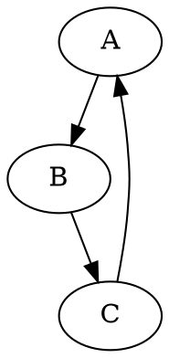

# pipeline-visualization
how to render a pipeline flow with graph and time chart

# usage
The pipeline can bun run with

    run

which will execute `runner.py` from venv

testing containers e.g. graphviz rendering

create `cache/test/example.dot` with content such as

note cache is mapped in `/data` inside the container.

Then generate the graph with

    run graphviz test/example.dot

