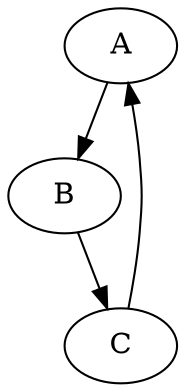

# pipeline excution and visualization
simple python pipeline engine that generates visualization for execution timeline information and steps dependencies in a graph

https://networkgraphs.github.io/pipeline-visualization/

# usage
The pipeline can bun run with

    run

which will execute `runner.py` from venv

it takes as input a manifest file, as example
```yaml
# Stage > Job
pipeline:
  fetch:
    fetch-data-1: pipeline.py#fetch
  process:
    calculate-functions: pipeline.py#calculate
    compute-statistics: pipeline.py#compute
  build:
    generate-website: pipeline.py#build
```
which is a map of stages and jobs ponting to python files and entry point functions from [pipeline.py](./pipeline.py)

The execution will generate
- pipeline.json : a list of all execution steps and their timing information
- artifacts.json : a list of all generated artifacts
- depedencies.json : a graph of depedencies between steps through artifacts usage

see example output in https://networkgraphs.github.io/pipeline-visualization/

# Testing
## graphviz
testing containers e.g. graphviz rendering

create `cache/test/example.dot` with content such as

note cache is mapped in `/data` inside the container.

Then generate the graph with

    run graphviz test/example.dot

## web server
this command will serve the content of `./docs` directory

    cmd server
